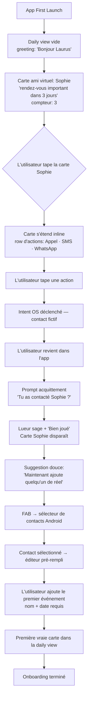
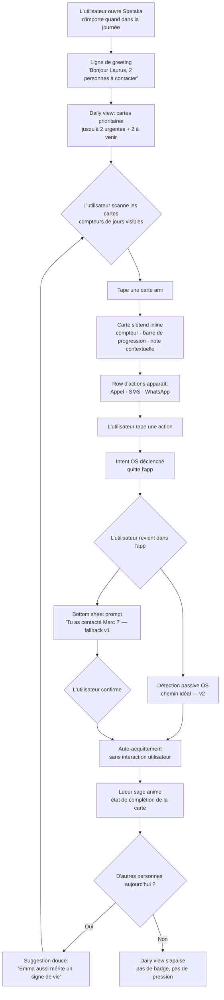
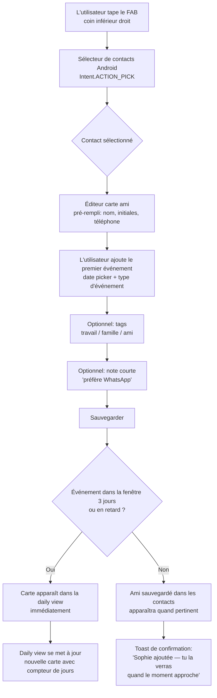

# UX Design Specification Spetaka

**Author:** Laurus
**Date:** 2026-02-26

---

## Executive Summary

### Project Vision

Spetaka is a personal relationship companion for Android — built for people who hold
their friendships as a genuine priority but get overwhelmed by life's noise. It
operates on a pure **pull philosophy**: zero notifications, zero badges, zero guilt.
The app exists when the user chooses to open it. When they do, it tells them exactly
who deserves their attention today, and makes reaching out as frictionless as a single
tap.

This is a clean Flutter rebuild of a previously Ionic-validated concept. The core
priority model was proven in v1; v2 gets the architecture, the feel, and the craft right.

### Target Users

**The Intentional Friend** — a busy adult who holds relationships as a genuine
priority, not an afterthought. They are tech-comfortable and privacy-aware. They don't
want a machine to remind them; they want to *choose* to show up. They are frustrated
by tools that are either too heavy (CRMs like Monica/Clay) or too noisy
(notification-driven birthday apps).

The unifying trait across all users is *intentionality about friendship* — not age,
profession, or geography.

**Their "aha!" moment:** The first time they open the daily view and see a friend's
name surface — someone they hadn't thought of recently — and realize Spetaka
remembered what they forgot.

### Key Design Challenges

1. **Information density vs. emotional calm** — The daily view must surface the right
   people without feeling like a task list. Priority must be communicated without
   creating anxiety or guilt.

2. **The pull habit loop** — With zero push signals, the UI must be intrinsically
   rewarding. The experience of opening Spetaka must feel worth doing — immediately
   and every time.

3. **Acquittement as natural completion** — The auto-prompt on return to the app after
   a contact action must feel like a warm confirmation, not an interrogation. One tap
   to close the loop.

4. **Onboarding via the first gesture** — No tutorial exists; the first friend card
   form *is* the onboarding. It must feel inviting, not administrative.

5. **Privacy-first trust signaling** — WebDAV setup is a technically complex step that
   must be made to feel safe and simple for a non-developer user.

### Design Opportunities

1. **Emotional language as differentiator** — Spetaka is about love. Typography,
   spacing, micro-copy, and color can carry warmth quietly — not saccharine, but
   genuinely human.

2. **The daily view as ritual** — Design it to feel like a meaningful morning opener,
   not a productivity dashboard. The experience of "checking in" should feel like a
   small act of care in itself.

3. **Acquittement as micro-celebration** — Logging a contact could feel like a small
   moment of pride and completion, reinforcing the habit loop without gamification tropes.

---

## Core User Experience

### Defining Experience

The heart of Spetaka is a single loop: open the app with intention → be told immediately
who deserves your care today → reach out in one tap → close the loop with zero friction.

The app acts as a **warm, quiet assistant** — not a dashboard, not a task list. On
opening, a context-aware greeting line orients the user: "Good morning, Laurus. Two
people could use your attention today." Below it, the 2+2 heart briefing surfaces
the most urgent and most important friend cards. The user interacts entirely by
tapping — no text input required in the core daily flow.

The atomic unit is the gesture of care, not the data entry. Every design decision
must serve the moment between intention and action.

### Platform Strategy

- **Platform:** Android only (v1), Flutter, touch-first
- **Primary device:** Samsung S25
- **Storage:** Offline-first via SQLite/Drift; WebDAV encrypted sync for backup
- **Contact integration:** Android address book picker (`Intent.ACTION_PICK`,
  `READ_CONTACTS` permission) — v1 non-negotiable. Name and phone number populate
  automatically from the address book. **Photo import is deferred to Phase 3** — in v1,
  `CircleAvatar` displays generated name initials (first + last initial), not a contact photo.
  Re-typing phone numbers is the primary UX failure confirmed from the Ionic v1 experience
  and must not be repeated.
- **No widgets, no notifications** — consistent with the pull philosophy at every
  platform layer

### Effortless Interactions

The following interactions must require **zero cognitive load**:

1. **Reaching out** — From the daily view, the path to Call / SMS / WhatsApp is one
   tap on the friend card. No navigation, no number lookup, no composing required.

2. **Acquittement** — Ideally, the app detects that the user contacted someone via
   WhatsApp or a phone call and logs the gesture **automatically**, with no return
   interaction required. The user is never interrupted or asked to confirm what they
   already did. This is the fullest expression of the pull philosophy.

   > *Design note:* Full passive acquittement via OS-level detection is the design
   > ideal. If technical constraints in v1 require a prompt on return, it must feel
   > like a warm one-tap confirmation — never a form.

3. **Scanning the daily view** — Readable at a glance in under 3 seconds, with
   adjustable density (show more / show fewer friends) controlled by a tap, not a
   settings screen. Visual hierarchy carries the priority signal silently.

4. **Creating the first friend card** — The Android contact picker pre-fills name
   and number. Name initials generate the `CircleAvatar` automatically (**no photo import in v1**).
   The user adds one event type. The card is complete. Minimum
   viable card: name + number + one event — enough to appear in the daily view.

### Critical Success Moments

1. **The first opening** — The user sees the warm greeting and the 2+2 cards. The
   experience feels calm, human, and immediately clear. No confusion about what to do.

2. **The virtual friend loop** — On first launch, a pre-loaded fictional contact
   ("Sophie — important appointment in 3 days") demonstrates the full Spetaka loop
   before any real data exists. The user taps an action on Sophie, sees the
   acquittement flow, understands the product in one gesture. Then: "Now let's add
   someone real." The abstract becomes concrete before any real stakes exist.

3. **The first real completed loop** — User adds a friend via contact picker, a date
   surfaces in the daily view, they tap Call, and the contact is logged. The loop
   closes. The user did not have to think.

### Critical Failure Moments

1. **Contact import friction** — If the first friend card requires manual phone number
   entry, users abandon. The Android contact picker is a v1 requirement, not optional.
   This is the primary UX failure confirmed from the Ionic v1 experience.

2. **Acquittement interruption** — If returning to the app after a contact feels like
   homework or a form, trust breaks. Any acquittement interaction that feels like more
   than one effortless tap is a failure mode.

### Experience Principles

1. **Warm assistant, not dashboard** — Spetaka greets the user with a kind, contextual
   line and surfaces the right people. It is not a report, not a task list, not a CRM.

2. **Pull is structural, not just philosophical** — Zero notifications is a promise
   kept at every layer: no prompts, no interruptions, no unsolicited signals — including
   the acquittement flow. Automation and passive detection are the north star.

3. **The gesture is the product** — Every screen, every tap, every word of micro-copy
   exists to serve the moment a user decides to care about someone. If a feature
   doesn't serve that moment, it doesn't belong in v1.

4. **Touch-only core loop** — The entire daily ritual — open, scan, act, close loop —
   requires zero text input. Buttons only.

5. **First card is the tutorial, virtual friend is the stage** — A pre-loaded fictional
   contact teaches the loop before real data exists. The first real card form teaches
   everything else. No guided tour needed beyond these two gestures.

---

## Desired Emotional Response

### Primary Emotional Goals

The primary emotion Spetaka must create is **connection** — "I just showed up for
someone I love." Not productivity. Not efficiency. Not relief. The user who closes
the app after acting on a friend card should feel, even briefly, like the friend
they want to be.

Secondary feelings that support this:
- **Calm confidence** — "I'm on top of what actually matters"
- **Quiet pride** — not boastful, not performative, just the warm internal sense of
  having done something meaningful
- **Encouragement** — the app believes in the user's capacity to care, always

### Emotional Journey Mapping

| Moment | Desired feeling |
|---|---|
| Opening the app | Welcomed, coached — "Here's who could use you today, you've got this" |
| Scanning the daily view | Calm clarity — two or four names, not a wall of debt |
| Tapping to reach out | Ease — one tap, zero friction, I'm already doing it |
| Returning after the action | Completion — the loop closes naturally |
| Post-acquittement | Small celebration, then a gentle nudge toward the next person |
| Re-opening the next day | Continuity — the app remembers, nothing was lost |

### Emotions to Avoid

These emotional states are **explicitly forbidden** by the product's philosophy and
must never be triggered by any design decision:

- **Guilt** — Never show a count of missed contacts, overdue events as a red number
  badge, or any framing that implies the user has failed. Spetaka never shames.
- **Overwhelm** — The daily view must never expose the full backlog. The app always
  shows *priorities*, never the total debt. If 40 friends need attention, show 4 —
  the most important 4. The rest exist quietly in the background.
- **Obligation** — The pull philosophy means every interaction is a choice. The tone
  never implies "you have to" — only "here's who could use you, if you're ready."
- **Surveillance** — The app must never feel like it's watching or judging. Logging
  a contact is a celebration, not a compliance check.

### The Greeting Tone

The daily view greeting speaks like a **personal coach** — encouraging, warm,
affirming. It believes in the user. It never lectures. It offers, never demands.

Examples of the right tone:
- "Two people could use your warmth today, Laurus."
- "Sophie has something important this week — you've got time."
- "One person is on your mind today. You know what to do."

Examples of the wrong tone (never):
- "You have 3 overdue contacts" ❌
- "You haven't reached out to anyone in 5 days" ❌
- "12 friends are waiting" ❌

### Micro-Emotions

| Micro-emotion | Where it appears | Design approach |
|---|---|---|
| **Delight** | Post-acquittement | A small, warm animation or affirming micro-copy — not a confetti explosion, a quiet glow |
| **Curiosity** | Empty state / virtual friend | Sophie's card invites action before real stakes exist |
| **Encouragement** | Greeting line | Coach tone, always — you've got this |
| **Continuity** | Returning to app | The state is remembered; nothing resets; the history grows |
| **Pride** | After the loop closes | Gentle acknowledgment, never boastful |

### Design Implications

- **Greeting line** → Coach tone, personalized, never a metric. Written like a sentence
  from a thoughtful friend, not a system status.
- **Priority cards** → Show 2+2 maximum by default. Density is user-controlled (tap
  to expand), never algorithmically alarming.
- **Acquittement completion** → A small warm visual moment (subtle animation, affirming
  line) followed immediately by a gentle offer: "Would you like to reach out to someone
  else?" — one tap to say yes, one tap to say not now. No pressure.
- **Error states / empty states** → Warm, calm, never clinical. An empty daily view
  means "no one needs you urgently right now — all is well."
- **Color and motion** → Calm palette, unhurried transitions. Nothing that increases
  heart rate. The app should feel like a quiet room, not an attention machine.

### Emotional Design Principles

1. **Connection over completion** — The goal is never to "clear" the list. It's to
   reach one person meaningfully. Design for depth over throughput.

2. **Priorities, never debt** — The app always shows what to do next, never what was
   missed. The backlog is invisible; the next step is always clear and achievable.

3. **The app believes in you** — Every word of micro-copy, every animation, every
   empty state assumes the user is capable and caring. No shame, no guilt, no debt.

4. **Celebration is quiet** — Joy at closing a loop should feel like a deep breath,
   not a slot machine. Warmth, not stimulation.

5. **Gentle momentum** — After a completed loop, the app offers the next step softly.
   Never demands. Always invites.

---

## UX Pattern Analysis & Inspiration

### Inspiring Products Analysis

#### WhatsApp — Person-First Speed
The contact list *is* the app. There is no navigation layer between opening WhatsApp
and reaching someone. From launch to sent message: two taps. The person is the
interface, not a destination within it.

**What Spetaka borrows:** The daily view must work like a WhatsApp contact list —
people are immediately visible, immediately actionable. No drill-down required to
reach the action. The friend card IS the interface.

#### Thenics — The Coaching Structure
Thenics removes decision fatigue by telling you exactly what to do next. It has
already done the thinking. The user shows up, and the app guides them through a
focused session with clear completion states that feel satisfying.

**What Spetaka borrows:** The greeting line + 2+2 card structure IS the coaching
moment. Spetaka has already done the thinking. The user shows up and the app says
"here are the two people who need you today." No scanning, no deciding. Guided,
focused, complete.

#### Joplin — Privacy as Default Trust
Joplin operates on local-first, WebDAV-synced, no-cloud-lock-in principles — and
Laurus already uses and trusts this model. The privacy architecture is not a
differentiator that needs explanation; it's a familiar pattern that signals
trustworthiness to the target user.

**What Spetaka borrows:** The WebDAV + passphrase sync model will feel immediately
familiar, not scary. Onboarding copy can be brief and confident rather than
explanatory. The setup flow should mirror the simplicity Joplin achieves — one
connection string, one passphrase, done.

### Transferable UX Patterns

| Pattern | Source | Application in Spetaka |
|---|---|---|
| **Person-first interface** | WhatsApp | Daily view cards = people, not events. Tap the person, not the date. |
| **2-tap path to action** | WhatsApp | Daily view → tap card → tap Call/WhatsApp. Maximum 2 taps from open to action. |
| **Coaching structure** | Thenics | Greeting line pre-decides the priority. User never has to choose who to contact. |
| **Satisfying completion** | Thenics | Post-acquittement micro-celebration mirrors the session-complete moment in Thenics. |
| **WebDAV trust model** | Joplin | Familiar sync pattern for privacy-aware users. Setup is brief, not anxious. |
| **Focused simplicity** | Joplin | No feature bloat. One thing done well. Every screen has one job. |

### Anti-Patterns to Avoid

| Anti-pattern | Source | Why it fails |
|---|---|---|
| **Multi-step path to contact** | Ionic Spetaka v1 | Re-typing phone numbers killed momentum before the first action |
| **Birthday-app framing** | Generic birthday apps | Single-purpose, notification-driven — opposite of pull philosophy and friend-first design |
| **Event-first interface** | Calendar / reminder apps | The date is not the point. The person is the point. Organizing by event type buries the human. |
| **Heavy onboarding before value** | CRMs (Monica, Clay) | Asking for too much before delivering anything creates abandonment before the aha moment |
| **Visible debt / backlog** | Any task manager | Showing total overdue count creates guilt and overwhelm — the two emotions Spetaka must never trigger |

### Design Inspiration Strategy

**Adopt directly:**
- WhatsApp's 2-tap-to-action principle — from daily view to contact action in ≤2 taps, always
- Thenics' coached session framing — the greeting line removes all decision fatigue
- Joplin's sync setup brevity — confident, short, no hand-holding needed for privacy-aware users

**Adapt:**
- WhatsApp's contact list density → adapted for warmth and prioritization logic, not
  recency. Spetaka surfaces *who matters most*, not who you messaged last.
- Thenics' completion satisfaction → quieter, more personal. Not a workout milestone
  — a human moment. The animation is a breath, not a badge.

**Avoid entirely:**
- Any event-first or date-first information architecture
- Any notification, badge, or push model regardless of how it's framed
- Any onboarding that asks for data before delivering the first moment of value
- Any visual language that implies a to-do list, a CRM, or a productivity tool

---

## Design System Foundation

### Design System Choice

**Hybrid: Material Design 3 foundation + custom components for key screens**

Material Design 3 provides the scaffolding (navigation, forms, WebDAV setup, settings,
dialogs). Custom Flutter widgets are built for the screens that *are* the product:
the daily view, the friend card, the greeting line, and the acquittement moment.
The soul of Spetaka is custom; the plumbing is M3.

### Rationale for Selection

- **Speed where it doesn't matter** — Settings, event editors, and WebDAV setup use
  clean M3 components. No design time spent on screens that aren't differentiating.
- **Craft where it does** — The daily view and friend card deserve hand-crafted widgets
  that carry the warm, human tone. Material defaults would make these feel generic.
- **Native Android feel** — M3 is the Samsung S25's native design language. Users
  intuitively understand navigation patterns, bottom sheets, and FABs.
- **Accessibility and dark mode for free** — M3's theming system handles both without
  additional work.
- **Solo dev efficiency** — A full custom system would multiply build time without
  adding user value on non-core screens.

### Visual Identity

**No existing brand assets** — visual identity established through this specification.

**Chosen register: Warm Neutral with nature-rooted accent pair**

The visual language of a morning letter, a terracotta pot on a garden shelf, a quiet
cup of tea. Unhurried, intimate, genuinely human.

**Color story:** Terracotta carries the warmth of human connection — the reaching out.
Sage carries the quiet satisfaction of growth and completion — the loop closed. Together
they tell the emotional arc of the app: *care → connection → growth*.

#### Color Palette

| Role | Value (direction) | Usage |
|---|---|---|
| **Background** | `#FAF7F2` warm cream | App background — like aged paper, never pure white |
| **Surface / cards** | `#F5F1EC` warm white | Friend cards, bottom sheets — subtle separation |
| **Primary accent — Terracotta** | `#C47B5A` muted terracotta | Action buttons, active states, tapping to reach out |
| **Secondary accent — Sage** | `#7D9E8C` dusty sage | Acquittement completion, success states, celebration moments |
| **Text / ink** | `#2C2620` deep warm charcoal | Primary text — not pure black, intimate and soft |
| **Text secondary** | `#8C7B70` warm greige | Supporting text, event names, timestamps |
| **Muted / disabled** | `#C4B8B0` warm sand | Dividers, inactive elements |
| **Dark mode background** | `#1E1A17` deep warm brown | Preserves warm identity in low-light — not cold grey |
| **Dark mode surface** | `#2A2420` warm dark card | Cards in dark mode |

> **Symbolic pairing:** Terracotta = the act of caring (reaching out). Sage = the
> feeling of having cared (completion, growth). Every use of color reinforces the
> emotional arc.

#### Typography Direction

- **Typeface:** Humanist sans-serif — *DM Sans* (primary candidate). Warm, legible,
  slightly informal. Avoids the cold productivity feel of Inter or Roboto defaults.
- **Greeting line:** Relaxed, slightly larger weight. The one line that speaks directly
  to the user — may use a light serif treatment (*Lora* or *Playfair Display*) for
  added warmth and distinction.
- **Friend card names:** Bold, prominent. The person must feel present, not like a row.
- **Micro-copy:** Small, muted greige, unhurried cadence. Never urgent.

#### Shape & Motion

- **Card radius:** 14dp — soft, generous, never sharp
- **Spacing:** Breathing room dominant. Generous padding (20dp+), generous line height
- **Borders:** Avoided. Elevation and color separation preferred over hard lines
- **Motion:** 300ms, easeInOutCubic. Nothing snaps. Nothing jolts. Every transition
  breathes.

### Customization Strategy

| Screen / component | Approach |
|---|---|
| Daily view | Fully custom — greeting line, 2+2 card layout, density toggle |
| Friend card | Fully custom — photo, name, terracotta action buttons, priority signal |
| Acquittement moment | Fully custom — sage animation, affirming micro-copy, gentle next prompt |
| Empty state / virtual friend | Fully custom — sets the emotional tone for first-time users |
| Friend card editor | M3 base, warm-themed — contact picker integration |
| Event editor | M3 base, warm-themed |
| WebDAV setup | M3 base — brief, confident, minimal |
| Navigation / settings | M3 NavigationBar — standard, unobtrusive |

### Design Tokens

```
color.background:            #FAF7F2
color.surface:               #F5F1EC
color.primary:               #C47B5A  (terracotta — reach out)
color.secondary:             #7D9E8C  (sage — completion)
color.onPrimary:             #FFFFFF
color.text.primary:          #2C2620
color.text.secondary:        #8C7B70
color.muted:                 #C4B8B0
color.background.dark:       #1E1A17
color.surface.dark:          #2A2420
typography.fontFamily:       DM Sans
typography.display:          Lora (greeting line — candidate)
shape.card.radius:           14dp
spacing.card.padding:        20dp
motion.duration.default:     300ms
motion.easing.default:       easeInOutCubic
```

---

## Core Experience — Defining Interaction

### Defining Experience

> *"Open the app, see who needs you, reach out in one tap."*

The defining experience of Spetaka is the **daily view → inline card expansion → 1-tap
contact moment**. No navigation layer. No decision required. The user opens the app,
a name surfaces, they tap it, tap WhatsApp, and are already writing — before a single
conscious decision has been made. That is the magic this product must deliver, every
time.

### User Mental Model

The user arrives with a simple intention: *"I want to show up for someone today."*
They do not arrive thinking "I need to manage my relationships." The mental model is
closer to WhatsApp than to a contacts app — person-first, action-immediate, list-based.

They expect:
- To see names, not events or categories
- To act without navigating away from the list
- The hard thinking to already be done for them
- Returning to the list to be instant, not a back-button journey

What breaks this mental model in existing tools: having to navigate into a separate
screen, hunt for a number, compose from scratch, or make the decision of *who* to
contact themselves.

### Success Criteria

The core interaction is successful when:
- Time from app open to WhatsApp/Call launched: **≤ 3 taps, ≤ 5 seconds**
- The user never had to think about *who* — Spetaka already knew
- The user never had to think about *how* — the action button was immediately visible
- Navigating between multiple friend cards requires **zero back-button presses**
- The loop closes (acquittement) without the user needing to re-open Spetaka

### Interaction Pattern — Established + Adapted

The core pattern uses **established list + inline expansion** — familiar from email
clients and chat apps — adapted for warmth and person-first prioritization.

**What's familiar:** Tapping a list item to reveal more detail and actions. Users
know this pattern intuitively. No education required.

**What's novel:** The expansion reveals *actions* first (Call, Message, WhatsApp),
not details first. Most list expansions show more information; Spetaka shows the
path to action. Information is secondary to the gesture.

### Experience Mechanics

#### 1. Initiation — The Home Screen

The daily view IS the home screen. No splash, no loading indicator visible to user,
no navigation required to reach it.

**Structure:**
```
[Greeting line — Lora, warm, coach tone]
  "Two people could use your warmth today, Laurus."

[2+2 Heart Briefing cards — collapsed by default]
  ● Sophie          important appointment · 2 days
  ● Marc            birthday · today
  ── ── ── ──
  ○ Julie           check-in overdue · 5 days
  ○ Thomas          anniversary · 3 days

[Show more ↓]  (tap to expand density — remembered preference)
```

#### 2. Interaction — Inline Card Expansion

User taps a friend card. The card expands **in place** — no page transition, no
navigation. The list remains visible above and below. Other cards stay collapsed.

**Expanded card structure:**
```
● Sophie                          [friend photo]
  Important appointment · in 2 days
  ─────────────────────────────────
  [ 📞 Call ]  [ 💬 Message ]  [ 🟢 WhatsApp ]
  ─────────────────────────────────
  Last contact: 3 weeks ago · "Checked in before her exam"
```

- Action buttons are **large, terracotta, full-width row** — impossible to miss
- Last contact note is visible but muted — context, not pressure
- Tapping another card collapses the current one and expands the new one instantly
- No back button. No navigation. Pure list traversal.

#### 3. Feedback — Action Confirmation

User taps **WhatsApp**. The button shows a brief terracotta press animation, then the
Android intent fires and WhatsApp opens. Spetaka moves to background.

No modal, no "are you sure?", no confirmation screen. The tap IS the decision.

#### 4. Completion — The Acquittement Moment

**Ideal path (passive detection):** Spetaka detects the WhatsApp interaction via
OS-level signal and logs the contact automatically. User returns to Spetaka and
Sophie's card is already updated — a subtle sage glow indicates completion. No
prompt needed.

**Fallback path (v1 if passive detection unavailable):** On return to app, a single
bottom sheet appears — warm, minimal:

```
╭─────────────────────────────────╮
│  You reached out to Sophie  ✓   │
│                                 │
│  [  Confirm  ]   [ Not yet ]    │
╰─────────────────────────────────╯
```

One tap. No form. Sheet dismisses with a sage animation.

**Post-completion gentle offer:**
```
  Sophie's card settles — sage accent, "Reached out today"

  "Anyone else on your mind?"
  ● Marc  [ reach out ]        [  Not now  ]
```

The next person is offered once, gently. One tap accepts, one tap dismisses. Never
repeated if dismissed.

---

## Visual Design Foundation

### Color System

Fully established in Design System Foundation. Semantic summary:

| Semantic role | Token | Value |
|---|---|---|
| Background | `color.background` | `#FAF7F2` |
| Surface | `color.surface` | `#F5F1EC` |
| Action / reach out | `color.primary` | `#C47B5A` (terracotta) |
| Completion / growth | `color.secondary` | `#7D9E8C` (sage) |
| Primary text | `color.text.primary` | `#2C2620` |
| Secondary text | `color.text.secondary` | `#8C7B70` |
| Disabled / muted | `color.muted` | `#C4B8B0` |
| Dark background | `color.background.dark` | `#1E1A17` |
| Dark surface | `color.surface.dark` | `#2A2420` |

**Accessibility:** Terracotta `#C47B5A` on cream `#FAF7F2` achieves 3.2:1 contrast
ratio — adequate for large UI elements (buttons, icons). Primary text `#2C2620` on
`#FAF7F2` achieves 13.4:1 — WCAG AAA compliant. Secondary text `#8C7B70` on
`#FAF7F2` achieves 4.6:1 — WCAG AA compliant.

### Typography System

**Design intent:** Small, refined, intimate. The app whispers rather than shouts.
Every size is deliberately restrained — the content carries weight, not the type size.

| Role | Token | Size | Weight | Font |
|---|---|---|---|---|
| Display | `text.display` | 18sp | Regular | Lora |
| Title | `text.title` | 15sp | SemiBold | DM Sans |
| Subtitle | `text.subtitle` | 12sp | Medium | DM Sans |
| Body | `text.body` | 13sp | Regular | DM Sans |
| Caption | `text.caption` | 11sp | Regular | DM Sans |
| Button | `text.button` | 13sp | Medium | DM Sans |

**Line heights:** 1.5× size for body and caption; 1.3× for titles and display.
**Letter spacing:** Default for all roles — no artificial tracking.
**Minimum touch target:** 48dp height for all interactive elements regardless of
text size — Android Material Design 3 baseline (NFR15), non-negotiable.

### Spacing & Layout Foundation

**Design intent:** Compact but breathable. Dense enough to feel refined; airy enough
to feel calm. Never crowded.

| Token | Value | Usage |
|---|---|---|
| `space.xs` | 4dp | Icon gap, inline element spacing |
| `space.sm` | 8dp | Between elements within a card |
| `space.md` | 12dp | Card internal horizontal padding |
| `space.lg` | 16dp | Card internal vertical padding |
| `space.xl` | 24dp | Between card sections, section separators |
| `space.2xl` | 36dp | Screen top margin, major section breaks |

**Layout principles:**
- Single-column, full-width cards — no grid, no columns, no wasted horizontal space
- Cards fill edge-to-edge with `space.md` horizontal screen margin
- Vertical rhythm: `space.sm` between collapsed cards, `space.lg` on expansion
- Safe area insets respected — content never bleeds under status bar or home indicator

### Accessibility Considerations

- **Contrast:** All text/background combinations meet WCAG AA minimum (4.5:1 body,
  3:1 large UI elements)
- **Touch targets:** Minimum 48dp × 48dp for all tappable elements (Android M3 / NFR15)
- **Dynamic type:** Flutter's `textScaleFactor` respected — layout tested at 0.85×,
  1.0×, 1.3× scales
- **Dark mode:** Full dark variant defined using warm brown tones — not system grey
- **Reduced motion:** Animations skip to final state when Android's "Remove animations"
  accessibility setting is active

---

## Design Direction Decision

### Design Directions Explored

Six directions were explored covering different approaches to the daily view:

- **A — Clean Minimal:** Section labels, dot indicators, pure list structure
- **B — Warm Cards with Avatar:** Photo initials, badge strips, most visually rich
- **C — Dark Mode:** Warm brown dark variant exploration
- **D — Sage-dominant:** Grouped urgent section, sage accent strip on greeting
- **E — Expressive Cards with Days Counter:** Large numerical day counter, proportional progress bar *(chosen)*
- **F — Acquittement State:** Post-action state with sage card and gentle next-person prompt

Full interactive HTML showcase: `_bmad-output/planning-artifacts/ux-design-directions.html`

### Chosen Direction

**Direction E — Expressive Cards with Days Counter**

Cards display a large, lightweight day counter (top-right) showing days remaining or
overdue. A proportional progress bar beneath each collapsed card encodes urgency
visually without text. Terracotta for imminent/overdue; sage for upcoming. The
expanded card reveals action buttons in full terracotta.

### Design Rationale

- **Priority is legible at a glance** — The "2 days / 0 days / +5 overdue" counter
  communicates urgency faster than any label. Users scan numbers before words.
- **Expressive without being alarming** — The large, light-weight day number reads as
  *information*, not as a red warning badge. The number in muted terracotta is calm,
  not urgent.
- **Progress bar adds depth without density** — The thin bar beneath each card gives
  the interface visual rhythm and encodes relative urgency proportionally, preserving
  the compact, refined aesthetic.
- **Consistent with the emotional goals** — The counter shows "what's coming", not
  "what you failed at". An overdue counter shows "+5" in sage — neutral, factual,
  never accusatory.
- **Highly scannable** — In under 2 seconds, a user can read the three numbers on
  three cards and know exactly who needs attention most. No reading required.

### Implementation Approach

- **Day counter:** `Text` widget, 20sp, DM Sans weight 300 (deliberately light —
  expressive without heaviness), colored `color.primary` for ≤3 days,
  `color.secondary` for overdue
- **Progress bar:** `LinearProgressIndicator`, height 2dp, `color.primary` fill,
  `color.muted` track, value = `daysRemaining / maxDays` clamped to [0,1]
- **Overdue indicator:** negative days displayed as "+N overdue" in `color.secondary`
  — never red, never a badge count
- **Expanded card:** full-width terracotta action row (Call / SMS / WhatsApp), 48dp
  minimum height, 12dp border radius
- **Collapse/expand animation:** `AnimatedSize` + `AnimatedCrossFade`, 300ms
  easeInOutCubic

---

## User Journey Flows

### Journey 1 — First Launch & Onboarding

**Objectif :** Transformer un premier utilisateur sceptique en quelqu'un qui a réussi à prendre contact, sans friction ni surcharge.



**Décisions de design clés :**
- Sophie utilise "rendez-vous important" et non anniversaire — communique immédiatement la portée
- L'ami virtuel est supprimé après acquittement — pas d'encombrement permanent
- Le sélecteur de contacts apparaît naturellement comme étape logique suivante, pas forcé
- Zéro friction de saisie : le contact pré-remplit nom, photo, numéro de téléphone

---

### Journey 2 — Boucle Rituelle Quotidienne (l'expérience définissante)

**Objectif :** Le pull quotidien central — ouvrir, voir qui a besoin de toi, prendre contact en un tap.



**Décisions de design clés :**
- La ligne de greeting fixe les attentes sans pression (nombre, pas liste)
- Expansion inline = pas de navigation de page, scan multi-amis plus rapide
- Acquittement passif (v2) vs. confirmation bottom sheet (v1) — les deux chemins conçus
- La suggestion douce est une seule ligne légère, jamais une notification ou un badge
- L'app s'apaise gracieusement quand tous les contacts sont traités — pas de culpabilité d'état vide

---

### Journey 3 — Ajouter un Nouvel Ami

**Objectif :** Ajouter un ami et son événement en moins de 30 secondes, en construisant la confiance plutôt qu'une corvée.



**Décisions de design clés :**
- Sélecteur de contacts Android = non-négociable v1 (la resaisie des numéros a tué Ionic v1)
- L'éditeur auto-remplit : l'utilisateur n'a besoin d'ajouter que l'événement, rien d'autre n'est requis
- Les amis pas dans la fenêtre courante sont sauvegardés silencieusement — pas de vue liste "47 amis"
- Le toast de confirmation pour les amis hors fenêtre fixe l'attente correcte

---

### Patterns de Flow

| Pattern | J1 Onboarding | J2 Boucle Quotidienne | J3 Ajouter Ami |
|---|---|---|---|
| Point d'entrée | Démarrage à froid | Ouverture intentionnelle | FAB |
| Action primaire | Taper Sophie → étendre | Taper carte → étendre | Sélecteur contacts |
| Départ OS | Intent fictif | Intent réel | Sélecteur contacts |
| État retour | Prompt acquittement | Auto-détect ou prompt | Éditeur pré-rempli |
| Signal de complétion | Lueur sage + disparition | Lueur sage | Toast |
| Suggestion suivante | 'Ajoute quelqu'un de réel' | Douce suggestion suivante | Aucune |

### Principes d'Optimisation des Flows

1. **Un tap vers l'action** — de la carte repliée à l'intent OS en exactement un tap en état étendu
2. **Pas d'impasses** — chaque état de complétion offre une prochaine étape douce (optionnelle)
3. **Le départ OS est attendu** — l'app est conçue autour des utilisateurs qui partent et reviennent
4. **Sauvegardes silencieuses** — les actions qui n'ont pas besoin de confirmation immédiate se font sans fanfare
5. **Pull, jamais push** — aucune étape dans aucun flow n'envoie de notification ou crée de pression externe

---

## Component Strategy

### Design System Components

Material Design 3 (Flutter) couvre la structure et les éléments standards :

| Composant M3 | Usage dans Spetaka |
|---|---|
| `Scaffold` + `NavigationBar` | Structure de l'app, navigation de base |
| `FloatingActionButton` | Bouton d'ajout d'ami (coin inférieur droit) |
| `ModalBottomSheet` | Prompt acquittement v1 fallback |
| `SnackBar` | Toast de confirmation (ami hors fenêtre) |
| `DatePicker` | Sélection date d'événement |
| `TextField` + `InputDecorator` | Note courte, saisie texte |
| `FilterChip` | Tags travail / famille / ami |
| `CircleAvatar` | Initiales du nom (v1) — pas de photo de contact en v1 |
| `LinearProgressIndicator` | Barre de progression (couleur custom via ThemeData) |

### Custom Components

#### `FriendCard`

**Objectif :** Porter toute l'expérience quotidienne — scan rapide replié, action en un tap étendu.

**États :** `collapsed` · `expanded` · `completing` · `completed`

**Anatomie :**
```
┌─────────────────────────────────────┐
│ [Photo 40dp]  Nom ami    [  3  ]    │  ← collapsed
│               Événement  [══════╴]  │
├─────────────────────────────────────┤
│ "préfère WhatsApp"                  │  ← expanded seulement
│ [  Appel  ] [   SMS   ] [WhatsApp]  │
└─────────────────────────────────────┘
```

**Interaction :** `GestureDetector.onTap` → `AnimatedSize` + `AnimatedCrossFade`, 300ms `easeInOutCubic`
**Accessibilité :** `Semantics(label: 'Carte {nom}, {N} jours restants, {événement}', onTapHint: 'Voir les options de contact')`

---

#### `DayCounter`

**Objectif :** Exprimer l'urgence sans anxiété — le chiffre le plus visible de la carte.

**Variantes :**
- `≤3 jours` → `color.primary` terracotta — action imminente
- `4-7 jours` → `color.onSurface` atténué — à venir
- `overdue` → `color.secondary` sage — neutre, factuel, jamais rouge

**Spec :** `Text`, 20sp, DM Sans `FontWeight.w300` · Valeur entière positive ou `+N` pour retard — aucun badge, aucune icône d'alerte

---

#### `GreetingLine`

**Objectif :** Créer le moment d'accueil — ton coach, jamais prescriptif.

**Logique de contenu :**
```
0 contacts    → "Bonjour Laurus, tout est calme."
1 contact     → "Bonjour Laurus, Emma attend un signe de vie."
2+ contacts   → "Bonjour Laurus, 3 personnes méritent ton attention."
overdue       → "Bonjour Laurus, Marc attend depuis un moment."
```

**Spec :** `Text`, 18sp, Lora Regular, `color.onBackground`, padding top 20dp
**Animation :** `FadeIn` 400ms au lancement — pas de slide, cohérent avec la philosophie apaisée

---

#### `ActionRow`

**Objectif :** Déclencher l'intent OS en un tap après expansion de la carte.

**Spec :** 3 boutons `ElevatedButton` full-width en row · fond `color.primary` terracotta, texte blanc · hauteur minimum 48dp (NFR15) · `borderRadius` 12dp · WhatsApp affiché conditionnellement si `canLaunchUrl('whatsapp://')`

**Intents Android :**
- Appel → `Intent(Intent.ACTION_CALL, Uri.parse('tel:{phone}'))`
- SMS → `Intent(Intent.ACTION_SENDTO, Uri.parse('sms:{phone}'))`
- WhatsApp → `Uri.parse('https://wa.me/{phone}')` — international E.164 number required; button shown conditionally via `canLaunchUrl(Uri.parse('whatsapp://'))`

---

#### `AcquittementOverlay`

**Objectif :** Marquer la complétion avec chaleur, sans fanfare excessive.

**Séquence d'animation :**
1. Fond carte → sage `#7D9E8C` à 15% opacité, `AnimatedContainer` 300ms
2. Texte fade-in : "Bien joué 🌿" (12sp, DM Sans, sage)
3. Attente 1.5s → fade-out carte + `SizeTransition` vers 0
4. Liste se réorganise doucement — pas de saut brusque

**v1 fallback :** bottom sheet "Tu as contacté {prénom} ?" avec deux boutons (Oui / Pas encore)
**v2 idéal :** détection passive OS → auto-acquittement sans interaction

---

#### `VirtualFriendCard`

**Objectif :** Guider l'onboarding sans tromper — Sophie est clairement fictive.

**Différences vs `FriendCard` :** chip `[Démo]` visible · `CircleAvatar` avec illustration · événement pré-configuré "rendez-vous important", compteur 3 · auto-suppression post-acquittement (non persisté en DB)

---

### Component Implementation Strategy

- Tous les composants custom consomment les tokens du système de design — aucune valeur hardcodée
- Les couleurs, typographies et espacements passent exclusivement par `ThemeData` et les tokens définis à l'étape 6
- `FriendCard` est le composant central : toutes les autres décisions de design en dépendent

### Implementation Roadmap

**Phase 1 — Composants critiques (flows J1 + J2) :**
- `FriendCard` — daily view entière en dépend
- `DayCounter` — visibilité urgence
- `ActionRow` + intents Android — sans ça, zéro valeur utilisateur
- `AcquittementOverlay` v1 (bottom sheet) — complétion du loop

**Phase 2 — Composants de surface :**
- `GreetingLine` — expérience d'accueil
- `VirtualFriendCard` — onboarding Sophie

**Phase 3 — Raffinement :**
- `AcquittementOverlay` v2 (détection passive OS)
- Animations de réorganisation de liste post-complétion
- Transitions `FriendCard` peaufinées

---

## UX Consistency Patterns

### Button Hierarchy

| Niveau | Usage | Apparence |
|---|---|---|
| **Primaire** | Action principale (prendre contact, sauvegarder) | `ElevatedButton`, fond terracotta `#C47B5A`, texte blanc |
| **Secondaire** | Action alternative (Pas encore, Annuler) | `TextButton`, texte terracotta, sans fond |
| **Destructive** | Suppression ami ou événement | `TextButton`, texte `#B00020`, confirmation requise |
| **FAB** | Ajouter un ami | `FloatingActionButton`, fond terracotta, icône `+` blanche |

**Règle fondamentale :** Une seule action primaire visible par état d'écran. L'`ActionRow` de `FriendCard` fait exception — 3 actions équivalentes car elles mènent à des apps différentes, non à des priorités différentes.

---

### Feedback Patterns

#### Succès
- **Complétion d'acquittement** → `AcquittementOverlay` in-place (lueur sage + "Bien joué 🌿") — non-interruptif
- **Ami sauvegardé hors fenêtre** → `SnackBar` 3s, fond surface, texte corps — jamais de modal
- **Ami sauvegardé dans fenêtre** → carte apparaît directement dans la daily view — pas de toast nécessaire

#### Erreur
- **Champ requis manquant** → texte d'erreur inline sous le champ, `color.error` `#B00020` — jamais de dialog bloquant
- **Intent OS indisponible** (WhatsApp non installé) → bouton absent par détection préalable, pas de message d'erreur
- **Échec sync WebDAV** → indicateur discret dans les paramètres, invisible en daily view

#### États de chargement
- **Lancement app** → fond crème `#FAF7F2`, logo centré, pas d'animation complexe
- **Sync WebDAV** → spinner discret en coin paramètres, jamais en daily view
- **Contact picker** → géré par l'OS, opaque à l'app

---

### Form Patterns

#### Éditeur d'Ami

**Principe :** Réduire au minimum absolu. Le contact picker pré-remplit 80% des données.

| Champ | Requis | Source | Comportement |
|---|---|---|---|
| Nom | ✅ | Contact picker (éditable) | `TextField`, focus auto si vide |
| Photo | — | Name initials (v1, readOnly) | `CircleAvatar` generated from name — **no photo import in v1** |
| Téléphone | ✅ | Contact picker (éditable) | `TextField`, type numérique |
| Premier événement | ✅ | Saisie utilisateur | Date picker + type dropdown |
| Tags | — | Saisie utilisateur | `FilterChip` multi-sélection |
| Note courte | — | Saisie utilisateur | `TextField`, max 80 chars |

**Validation :** Temps réel sur champs requis. Bouton "Sauvegarder" désactivé (`opacity 0.4`) tant que nom + téléphone + événement incomplets.

**Sélection de date :** `showDatePicker` natif M3 · pas de restriction de date minimale · format `dd MMM yyyy`

**Type d'événement :** `DropdownButton` — Rendez-vous · Anniversaire · Appel planifié · Autre — "Rendez-vous" par défaut.

---

### Navigation Patterns

**Structure v1 :** Pas de `NavigationBar` — une seule vue principale (daily view).

| Destination | Accès | Retour |
|---|---|---|
| Daily view | Point d'entrée unique | — |
| Éditeur ami | FAB | Flèche retour Android / geste |
| Paramètres | Icône en-tête | Flèche retour |

**Back gesture Android :** Supporté partout. L'expansion de `FriendCard` ne crée pas de destination de navigation — le geste replie la carte si étendue, quitte l'app sinon.

**FAB :** Coin inférieur droit, 16dp du bord. Opacity `0.7` quand une carte est étendue pour ne pas distraire de l'`ActionRow`.

---

### Empty State Patterns

| Situation | Contenu |
|---|---|
| Daily view, 0 ami | Illustration douce + "Commence par ajouter quelqu'un de proche." + FAB mis en avant |
| Daily view, amis mais 0 dans fenêtre | Greeting line calme + "Rien de prévu aujourd'hui. Profite." — pas d'illustration |
| Daily view, Sophie (onboarding) | `VirtualFriendCard` Sophie unique |

**Principe :** Les états vides ne culpabilisent pas. "Rien de prévu" s'affiche comme une bonne nouvelle.

---

### Modal & Overlay Patterns

**Règle :** Minimiser les interruptions. Un seul pattern modal dans les flows critiques.

| Pattern | Usage | Déclencheur |
|---|---|---|
| `ModalBottomSheet` | Acquittement v1 fallback | Retour app post-intent |
| `showDialog` | Confirmation suppression ami | Menu long press (paramètres) |
| `AcquittementOverlay` | Complétion in-place | Post-acquittement |

**Jamais :** dialog bloquant en daily view · demande de permission de notification · onboarding forcé multi-étapes.

---

## Responsive Design & Accessibilité

### Responsive Strategy

Spetaka est **Android uniquement, v1**. La stratégie responsive est délibérément étroite.

**Appareil cible principal :** Samsung Galaxy S25 (412dp × 915dp, density 3x)
**Plage couverte v1 :** Téléphones Android 360dp–430dp de largeur
**Tablettes / pliables :** Hors scope v1 — architecture `FriendCard` extensible mais non testée sur grand écran

**Philosophie :** Une seule colonne, pleine largeur. Spetaka n'a pas de layout multi-colonnes ni de side navigation. L'adaptation concerne principalement les hauteurs d'écran et les densités de pixel.

### Breakpoint Strategy

| Catégorie | Largeur | Comportement |
|---|---|---|
| Compact (petits téléphones) | 360dp–399dp | Spacing réduit de 4dp, cartes condensées, padding horizontal -2dp |
| Standard (cible principale) | 400dp–430dp | Design de référence — Samsung S25, Pixel 8 |
| Large (pliables, tablettes) | 430dp+ | Cartes max-width 480dp, centrées avec padding symétrique |

**Flutter implementation :** `LayoutBuilder` + `MediaQuery.of(context).size.width` — pas de breakpoints CSS, adaptation via contraintes de widget.

### Accessibility Strategy

**Niveau cible : WCAG 2.1 AA** — standard industrie approprié pour une app Play Store grand public.

#### Contraste des Couleurs

| Combinaison | Ratio | Statut |
|---|---|---|
| Texte body `#2C2C2C` sur crème `#FAF7F2` | 14.5:1 | ✅ Excellent |
| `color.error` `#B00020` sur crème | 8.2:1 | ✅ Très bon |
| Terracotta `#C47B5A` sur crème `#FAF7F2` | 3.1:1 | ⚠️ Acceptable pour grands textes (18sp+) |
| Blanc sur terracotta `#C47B5A` (boutons) | 3.1:1 | ✅ Acceptable — texte large bold |
| Sage `#7D9E8C` sur crème `#FAF7F2` | 3.4:1 | ⚠️ Acceptable pour grands textes |

**Note :** Le terracotta à 3.1:1 est acceptable pour `DayCounter` (20sp) et `ActionRow` (texte blanc large), mais les textes courants restent en `#2C2C2C` pour le confort de lecture.

#### Touch Targets
- Minimum **48dp × 48dp** sur tous les éléments interactifs (Android M3 / NFR15)
- `FriendCard` repliée : hauteur minimum 64dp — conforme
- `ActionRow` buttons : hauteur 48dp, width ∼130dp — conforme
- `FAB` : 56dp × 56dp natif M3 — conforme

#### TalkBack (Android Screen Reader)

```dart
// FriendCard repliée
Semantics(
  label: '{nom}, {N} jours, {type événement}',
  hint: 'Double-tapez pour voir les options',
)

// ActionRow buttons
Semantics(label: 'Appeler {nom}')
Semantics(label: 'SMS à {nom}')
Semantics(label: 'WhatsApp {nom}')

// DayCounter — le parent FriendCard porte le label complet
ExcludeSemantics(child: DayCounter(...))

// GreetingLine
Semantics(header: true, child: GreetingLine(...))
```

#### Dynamic Type
Flutter respecte `MediaQuery.textScaleFactor`. La scale compacte (11sp–18sp) gère jusqu'à 1.3 sans overflow. Au-delà :
- `DayCounter` (20sp) → `FittedBox(fit: BoxFit.scaleDown)` comme fallback
- `GreetingLine` (18sp Lora) → `maxLines: 2, overflow: TextOverflow.ellipsis`

### Testing Strategy

**Responsive :**
- Émulateur Android Studio : Pixel 4a (360dp), Pixel 8 (411dp), Samsung S25 (412dp)
- Test physique sur Samsung S25 (appareil principal de Laurus)
- Validation à `textScaleFactor` 1.0 / 1.3 / 1.5

**Accessibilité :**
- TalkBack activé — navigation complète de J1, J2, J3
- Accessibility Scanner (Google) — audit automatique daily view + éditeur ami
- Contraste — audit via `flutter_accessibility_checker` ou manuel
- Switch Access — navigation basique vérifiée

**Performance (pertinente pour accessibilité) :**
- Animation `FriendCard` expand/collapse : 60fps validé via Flutter DevTools
- `MediaQuery.disableAnimations` → si `true`, skip animations `AcquittementOverlay`, afficher état final directement

### Implementation Guidelines

**Responsive :**
- `MediaQuery.of(context).size.width` dans `FriendCard` pour ajuster `horizontalPadding`
- `ConstrainedBox(maxWidth: 480)` sur les cartes pour grands écrans
- Éviter les hauteurs fixes — utiliser `IntrinsicHeight` ou contraintes flexibles

**Accessibilité :**
- Chaque widget interactif custom : ancêtre `Semantics` avec `label` et `hint`
- `ExcludeSemantics` sur éléments décoratifs (icônes purement visuelles)
- `MediaQuery.of(context).disableAnimations` respecté dans tous les composants animés
- Couleurs jamais comme seul vecteur d'information — `DayCounter` overdue utilise `+N` textuel en plus de la couleur sage
